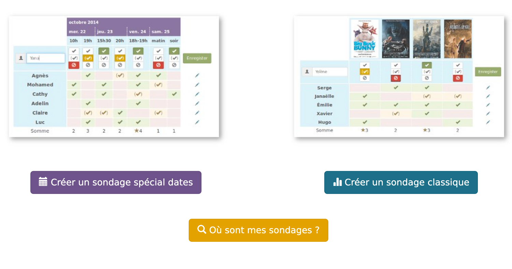

# Date
_____

**Date** est un service en ligne permettant de planifier un rendez-vous
ou prendre des décisions rapidement et simplement.
Aucune inscription préalable n’est nécessaire.

 Voir un exemple d'utilisation

 **Date** est basé sur le logiciel libre [Framadate](https://framadate.org)

## Comment ça marche ?


Je remercie chaleureusement l'association Framasoft qui a rédigé cette documentation pour son service Framadate, d'en permettre la reproduction et la modification. Ainsi je l'ai reprise et adaptée à **Date**.


 1. Créez un sondage
 -  Déterminez les dates ou les sujets à choisir
 -  Envoyez le lien du sondage à vos proches ou collègues
 -  Discutez et prenez votre décision

 Lire la documentation : Prise en main

## Présentation vidéo



<iframe class="responsive-iframe" width="560" height="315" sandbox="allow-same-origin allow-scripts allow-popups" src="https://framatube.org/videos/embed/827bdeff-759b-4e5f-94f9-0a272ae48157?warningTitle=0&peertubeLink=0" frameborder="0" allowfullscreen></iframe>


