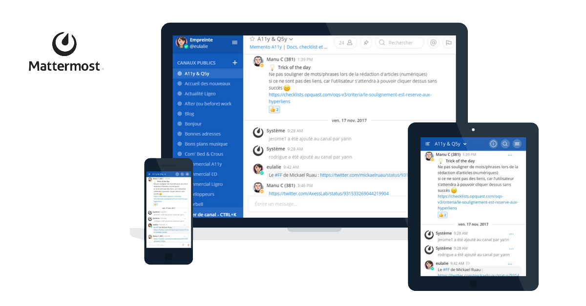

# Présentation du service
_____

## Discuter
**Mattermost est un service de discussion instantanée libre interne pour les associations, les groupes d'ami·e·s ou les familles.** Il permet de communiquer avec son équipe en notifiant ses membres, de conserver ses conversations et d'y faire des recherches.

Le service repose sur le logiciel libre *[Mattermost](https://mattermost.com)* maintenue et financée par [Herminien](https://blog.pcet.link) sur un serveur virtuel.

Pour mieux comprendre ses fonctionnalités et les usages possibles :

 Voir un exemple d'utilisation

Pour celleux qui connaissent, c'est une alternative à *Slack* et *Discord*.

## Comment ça marche ?

Rendez-vous sur https://discuter.pcet.link afin de créer votre compte pour fonder une équipe ou rejoindre une équipe éxistante.

Lire la documentation : **1. Premiers pas**


Je remercie chaleureusement l'association Framasoft qui a rédigé cette documentation pour son service Framateam (basé lui aussi sur Mattermost), d'en permettre la reproduction et la modification. Ainsi je l'ai reprise et adaptée à **Discuter**.


## A savoir

- Aucune donnée n’est recueillie de votre activité ici. Pour plus de détails, j'ai rédigé une rapide [politique de confidentialité](./politique-de-confidentialite/).
- Mon serveur fait 100 Go. Pour éviter ainsi qu'il ne se remplisse trop vite, j'ai limité la taille des pièces jointes à 10 Mo. Dans tous les cas, pour le partage de fichiers éphémères, n'hésitez pas à utiliser un service comme https://file.pcet.link (chiffré et hébergé sur ce même serveur en Suisse),  https://send.tresorit.com/ (chiffré, hébergé en Suisse) ou [recherchez d'autres alternatives sur le Wiki](https://wiki.pcet.link/alternatives/envoyer_fichiers) pour éviter de prendre inutilement de la place sur le serveur.
- Vous serez informé·e·s en avance de toute manipulation technique de ma part et trois mois au minimum avant la fermeture du service si cela devait malencontreusement arriver (ce qui n'est pas prévu, mais on ne sait jamais). Dans ce cas, toutes les données seront sauvegardées et pourront être récupérées.
- Si certain·e·s d’entre vous veulent me filer la patte ou me donner des conseils dans la gestion, la sauvegarde ou le développement de ce serveur Yunohost, c’est avec plaisir ! Ce n’est pas mon métier et je ne suis pas un spécialiste. :-)

Allez, maintenant, faites comme chez vous !
Et si vous avez des questions, n'hésitez pas à les poser ici ou sur herminien@pcet.link :-)
